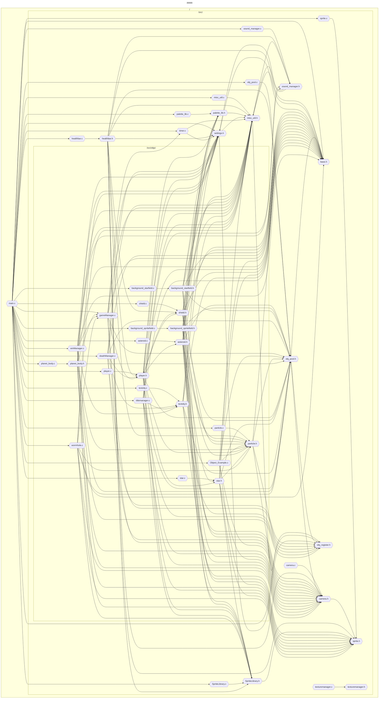

```mermaid
---
title: aaaa
---
flowchart
  subgraph TOP["/"]
  MAIN_C{{main.c}}
  subgraph SRC["/src/"]
  %% ...
  BASE_H{{base.h}}
  CAMERA_C{{camera.c}}
  CAMERA_H{{camera.h}}
  HEALTHBAR_C{{healthbar.c}}
  HEALTHBAR_H{{healthbar.h}}
  MISC_UTIL_C{{misc_util.c}}
  MISC_UTIL_H{{misc_util.h}}
  OBJ_POOL_C{{obj_pool.c}}
  OBJ_POOL_H{{obj_pool.h}}
  OBJ_REGISTER_H{{obj_register.h}}
  PALETTE_LIB_C{{palette_lib.c}}
  PALETTE_LIB_H{{palette_lib.h}}
  SETTINGS_H{{settings.h}}
  SOUND_MANAGER_C{{sound_manager.c}}
  SOUND_MANAGER_H{{sound_manager.h}}
  SPRITE_C{{sprite.c}}
  SPRITE_H{{sprite.h}}
  SPRITELIBRARY_C{{SpriteLibrary.c}}
  SPRITELIBRARY_H{{SpriteLibrary.h}}
  TEXTUREMANAGER_C{{texturemanager.c}}
  TEXTUREMANAGER_H{{texturemanager.h}}
  TIMER_C{{timer.c}}
  subgraph OBJS["/src/objs/"]
  ASTEROID_C{{asteroid.c}}
  ASTEROID_H{{asteroid.h}}
  BACKGROUND_SPRITEFIELD_C{{background_spritefield.c}}
  BACKGROUND_SPRITEFIELD_H{{background_spritefield.h}}
  BACKGROUND_STARFIELD_C{{background_starfield.c}}
  BACKGROUND_STARFIELD_H{{background_starfield.h}}
  DEATHMANAGER_C{{deathManager.c}}
  GAMEMANAGER_C{{gameManager.c}}
  OBJECT_EXAMPLE_C{{Object_Example.c}}
  PARTICLE_C{{particle.c}}
  PARTICLE_H{{particle.h}}
  PLANET_BODY_C{{planet_body.c}}
  PLANET_BODY_H{{planet_body.h}}
  PLAYER_C{{player.c}}
  PLAYER_H{{player.h}}
  SHIELD_C{{shield.c}}
  SHIELD_H{{shield.h}}
  STAR_C{{star.c}}
  STAR_H{{star.h}}
  TEXTOBJ_C{{textobj.c}}
  TEXTOBJ_H{{textobj.h}}
  TITLEMANAGER_C{{titlemanager.c}}
  WINMANAGER_C{{winManager.c}}
  WORMHOLE_C{{wormhole.c}}
  end
  end
  end

  %% ======== MAIN_C IMPORTS ========
  MAIN_C --> SPRITELIBRARY_C
  MAIN_C --> PALETTE_LIB_C
  MAIN_C --> SETTINGS_H
  MAIN_C --> SPRITE_C
  MAIN_C --> MISC_UTIL_C
  MAIN_C --> SOUND_MANAGER_C
  MAIN_C --> BASE_H
  MAIN_C --> OBJ_REGISTER_H
  MAIN_C --> ASTEROID_C
  MAIN_C --> PLAYER_C
  MAIN_C --> SHIELD_C
  MAIN_C --> TIMER_C
  MAIN_C --> OBJECT_EXAMPLE_C
  MAIN_C --> PARTICLE_C
  MAIN_C --> OBJ_POOL_C
  MAIN_C --> STAR_C
  MAIN_C --> TEXTOBJ_C
  MAIN_C --> WORMHOLE_C
  MAIN_C --> PLANET_BODY_C
  MAIN_C --> BACKGROUND_STARFIELD_C
  MAIN_C --> BACKGROUND_SPRITEFIELD_C
  MAIN_C --> HEALTHBAR_C
  MAIN_C --> GAMEMANAGER_C
  MAIN_C --> TITLEMANAGER_C
  MAIN_C --> DEATHMANAGER_C
  MAIN_C --> WINMANAGER_C

  %% ======== .c to .h IMPORTS ========
  CAMERA_C --> CAMERA_H
  HEALTHBAR_C --> HEALTHBAR_H
  MISC_UTIL_C --> MISC_UTIL_H
  OBJ_POOL_C --> OBJ_POOL_H
  PALETTE_LIB_C --> PALETTE_LIB_H
  SOUND_MANAGER_C --> SOUND_MANAGER_H
  SPRITE_C --> SPRITE_H
  SPRITELIBRARY_C --> SPRITELIBRARY_H
  TEXTUREMANAGER_C --> TEXTUREMANAGER_H
  ASTEROID_C --> ASTEROID_H
  BACKGROUND_SPRITEFIELD_C --> BACKGROUND_SPRITEFIELD_H
  BACKGROUND_STARFIELD_C --> BACKGROUND_STARFIELD_H
  PARTICLE_C --> PARTICLE_H
  PLANET_BODY_C --> PLANET_BODY_H
  PLAYER_C --> PLAYER_H
  SHIELD_C --> SHIELD_H
  STAR_C --> STAR_H
  TEXTOBJ_C --> TEXTOBJ_H

  %% ======== CAMERA_H IMPORTS ========
  CAMERA_H --> SPRITE_H

  %% ======== HEALTHBAR_H IMPORTS ========
  HEALTHBAR_H --> SOUND_MANAGER_H
  HEALTHBAR_H --> BASE_H
  HEALTHBAR_H --> SETTINGS_H
  HEALTHBAR_H --> MISC_UTIL_H
  HEALTHBAR_H --> PLAYER_H
  HEALTHBAR_H --> SHIELD_H
  HEALTHBAR_H --> CAMERA_H
  HEALTHBAR_H --> OBJ_POOL_H
  HEALTHBAR_H --> PARTICLE_H
  HEALTHBAR_H --> SPRITE_H
  HEALTHBAR_H --> SPRITELIBRARY_H

  %% ======== MISC_UTIL_H IMPORTS ========
  MISC_UTIL_H --> BASE_H
  MISC_UTIL_H --> OBJ_REGISTER_H
  MISC_UTIL_H --> SOUND_MANAGER_H

  %% ======== OBJ_POOL_H IMPORTS ========
  OBJ_POOL_H --> BASE_H
  OBJ_POOL_H --> OBJ_REGISTER_H
  OBJ_POOL_H --> CAMERA_H

  %% ======== PALETTE_LIB_H IMPORTS ========
  PALETTE_LIB_H --> MISC_UTIL_H

  %% ======== SETTINGS_H IMPORTS ========
  SETTINGS_H --> BASE_H
  SETTINGS_H --> MISC_UTIL_H
  SETTINGS_H --> OBJ_REGISTER_H

  %% ======== SOUND_MANAGER_H IMPORTS ========
  SOUND_MANAGER_H --> SETTINGS_H
  SOUND_MANAGER_H --> MISC_UTIL_H

  %% ======== SPRITELIBRARY_H IMPORTS ========
  SPRITELIBRARY_H --> SPRITE_H

  %% ======== TIMER_C IMPORTS ========
  TIMER_C --> SETTINGS_H
  TIMER_C --> MISC_UTIL_H

  %% ======== ASTEROID_H IMPORTS ========
  ASTEROID_H --> BASE_H
  ASTEROID_H --> SETTINGS_H
  ASTEROID_H --> MISC_UTIL_H
  ASTEROID_H --> PALETTE_LIB_H
  ASTEROID_H --> CAMERA_H
  ASTEROID_H --> OBJ_POOL_H
  ASTEROID_H --> SPRITE_H
  ASTEROID_H --> PARTICLE_H
  ASTEROID_H --> STAR_H
  ASTEROID_H --> SPRITELIBRARY_H

  %% ======== BACKGROUND_SPRITEFIELD_H IMPORTS ========
  BACKGROUND_SPRITEFIELD_H --> BASE_H
  BACKGROUND_SPRITEFIELD_H --> SETTINGS_H
  BACKGROUND_SPRITEFIELD_H --> MISC_UTIL_H
  BACKGROUND_SPRITEFIELD_H --> CAMERA_H
  BACKGROUND_SPRITEFIELD_H --> OBJ_POOL_H
  BACKGROUND_SPRITEFIELD_H --> PARTICLE_H
  BACKGROUND_SPRITEFIELD_H --> SPRITE_H
  BACKGROUND_SPRITEFIELD_H --> PALETTE_LIB_H
  BACKGROUND_SPRITEFIELD_H --> SPRITELIBRARY_H

  %% ======== BACKGROUND_STARFIELD_H IMPORTS ========
  BACKGROUND_STARFIELD_H --> BASE_H
  BACKGROUND_STARFIELD_H --> SETTINGS_H
  BACKGROUND_STARFIELD_H --> MISC_UTIL_H
  BACKGROUND_STARFIELD_H --> PALETTE_LIB_H
  BACKGROUND_STARFIELD_H --> CAMERA_H
  BACKGROUND_STARFIELD_H --> OBJ_POOL_H
  BACKGROUND_STARFIELD_H --> PARTICLE_H
  BACKGROUND_STARFIELD_H --> SPRITE_H

  %% ======== DEATHMANAGER_C IMPORTS ========
  DEATHMANAGER_C --> BASE_H
  DEATHMANAGER_C --> CAMERA_H
  DEATHMANAGER_C --> OBJ_POOL_H
  DEATHMANAGER_C --> TEXTOBJ_H
  DEATHMANAGER_C --> OBJ_REGISTER_H
  DEATHMANAGER_C --> SETTINGS_H
  DEATHMANAGER_C --> MISC_UTIL_H
  DEATHMANAGER_C --> PLAYER_H

  %% ======== GAMEMANAGER_C IMPORTS ========
  GAMEMANAGER_C --> BASE_H
  GAMEMANAGER_C --> CAMERA_H
  GAMEMANAGER_C --> TIMER_C
  GAMEMANAGER_C --> OBJ_POOL_H
  GAMEMANAGER_C --> PLAYER_H
  GAMEMANAGER_C --> OBJ_REGISTER_H
  GAMEMANAGER_C --> SETTINGS_H
  GAMEMANAGER_C --> MISC_UTIL_H

  %% ======== OBJECT_EXAMPLE_C IMPORTS ========
  OBJECT_EXAMPLE_C --> BASE_H
  OBJECT_EXAMPLE_C --> CAMERA_H
  OBJECT_EXAMPLE_C --> OBJ_POOL_H
  OBJECT_EXAMPLE_C --> PARTICLE_H
  OBJECT_EXAMPLE_C --> SPRITE_H

  %% ======== PARTICLE_H IMPORTS ========
  PARTICLE_H --> BASE_H
  PARTICLE_H --> OBJ_REGISTER_H
  PARTICLE_H --> CAMERA_H
  PARTICLE_H --> OBJ_POOL_H

  %% ======== PLANET_BODY_H IMPORTS ========
  PLANET_BODY_H --> BASE_H
  PLANET_BODY_H --> SETTINGS_H
  PLANET_BODY_H --> MISC_UTIL_H
  PLANET_BODY_H --> CAMERA_H
  PLANET_BODY_H --> OBJ_POOL_H
  PLANET_BODY_H --> PARTICLE_H
  PLANET_BODY_H --> SPRITE_H
  PLANET_BODY_H --> GAMEMANAGER_C
  PLANET_BODY_H --> SPRITELIBRARY_H

  %% ======== PLAYER_H IMPORTS ========
  PLAYER_H --> BASE_H
  PLAYER_H --> SETTINGS_H
  PLAYER_H --> MISC_UTIL_H
  PLAYER_H --> SHIELD_H

  PLAYER_H --> SPRITE_H
  PLAYER_H --> CAMERA_H

  PLAYER_H --> OBJ_POOL_H
  PLAYER_H --> PARTICLE_H
  PLAYER_H --> STAR_H
  PLAYER_H --> ASTEROID_H
  PLAYER_H --> SPRITELIBRARY_H
  PLAYER_H --> PALETTE_LIB_H

  %% ======== SHIELD_H IMPORTS ========
  SHIELD_H --> BASE_H
  SHIELD_H --> SETTINGS_H
  SHIELD_H --> MISC_UTIL_H
  SHIELD_H --> PLAYER_H

  SHIELD_H --> CAMERA_H

  SHIELD_H --> OBJ_POOL_H
  SHIELD_H --> PARTICLE_H

  SHIELD_H --> SPRITE_H
  SHIELD_H --> PALETTE_LIB_H

  %% ======== STAR_H IMPORTS ========
  STAR_H --> BASE_H

  STAR_H --> CAMERA_H

  STAR_H --> OBJ_POOL_H
  STAR_H --> PARTICLE_H

  STAR_H --> SPRITE_H
  STAR_H --> MISC_UTIL_H
  STAR_H --> SPRITELIBRARY_H

  %% ======== TEXTOBJ_H IMPORTS ========
  TEXTOBJ_H --> BASE_H

  TEXTOBJ_H --> CAMERA_H

  TEXTOBJ_H --> OBJ_POOL_H

  TEXTOBJ_H --> OBJ_REGISTER_H
  TEXTOBJ_H --> SETTINGS_H
  TEXTOBJ_H --> MISC_UTIL_H

  %% ======== TITLEMANAGER_C IMPORTS ========
  TITLEMANAGER_C --> BASE_H
  TITLEMANAGER_C --> SOUND_MANAGER_H

  TITLEMANAGER_C --> CAMERA_H

  TITLEMANAGER_C --> OBJ_POOL_H
  TITLEMANAGER_C --> TEXTOBJ_H

  TITLEMANAGER_C --> OBJ_REGISTER_H
  TITLEMANAGER_C --> SETTINGS_H
  TITLEMANAGER_C --> MISC_UTIL_H

  TITLEMANAGER_C --> SPRITELIBRARY_H

  %% ======== WINMANAGER_C IMPORTS ========
  WINMANAGER_C --> BASE_H
  WINMANAGER_C --> SOUND_MANAGER_H

  WINMANAGER_C --> CAMERA_H

  WINMANAGER_C --> OBJ_POOL_H
  WINMANAGER_C --> TEXTOBJ_H

  WINMANAGER_C --> GAMEMANAGER_C
  WINMANAGER_C --> OBJ_REGISTER_H
  WINMANAGER_C --> SETTINGS_H
  WINMANAGER_C --> MISC_UTIL_H

  %% ======== WORMHOLE_C IMPORTS ========
  WORMHOLE_C --> BASE_H
  WORMHOLE_C --> SETTINGS_H
  WORMHOLE_C --> MISC_UTIL_H

  WORMHOLE_C --> CAMERA_H

  WORMHOLE_C --> OBJ_POOL_H
  WORMHOLE_C --> PARTICLE_H
  WORMHOLE_C --> SPRITE_H

  WORMHOLE_C --> GAMEMANAGER_C
  WORMHOLE_C --> SPRITELIBRARY_H
```